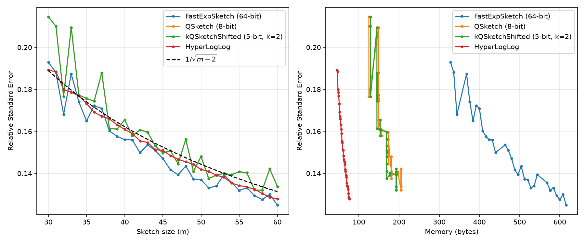

# weighted-cardinality-estimation

C++17 library with Python bindings for weighted cardinality estimation sketches.
Implements ExpSketch, QSketch, kQSketch (thesis contribution), LogExpSketch (thesis contribution), HyperLogLog, MinHash, and more — all accessible from Python with a unified API.

## Install

```bash
pip install weighted-cardinality-estimation
```

Development (from source):

```bash
pip install -e . --no-build-isolation
```

## Quickstart

```python
from weighted_cardinality_estimation import FastExpSketch

sketch = FastExpSketch(m=400, seed=42)
sketch.add("user_123", weight=5.0)
sketch.add("user_456", weight=2.3)
print(sketch.estimate())  # ≈ 7.3 (sum of distinct weights)
```

### Comparing sketch accuracy

Run [`quickstart.py`](quickstart.py) to generate this plot comparing RSE across sketch families:



All sketches converge to lower error as m increases. More registers (m) = more accuracy ≈ 1/√m.
Note: HyperLogLog is unweighted (estimates distinct count, not weight sum), so it solves an easier problem and may appear more accurate.

## Benchmarks

m=400, n=1000 elements, Lambda=500. Times in microseconds (lower is better).

| Sketch | Update (μs) | Update Ops/s | Estimate (μs) | Estimate Ops/s |
|--------|------------:|-------------:|--------------:|---------------:|
| FastExpSketchFloat32 | 570 | 1,756 | 8.7 | 115,184 |
| FastGMExpSketch | 574 | 1,742 | 16.0 | 62,408 |
| QSketchDyn | 576 | 1,736 | 49.5 | 20,195 |
| FastExpSketch | 604 | 1,657 | 13.3 | 75,108 |
| QSketch | 660 | 1,514 | 133.4 | 7,497 |
| FastExpSketchCustomFloat | 717 | 1,395 | — | — |
| LogExpSketchFastNoShifted | 719 | 1,390 | — | — |
| kQSketchShifted | 902 | 1,109 | 192.9 | 5,183 |
| kQSketchRounding | 1,096 | 912 | — | — |
| kQSketch | 1,187 | 842 | 183.4 | 5,452 |
| ExpSketch | 3,889 | 257 | 1.0 | 998,718 |
| ExpSketchFloat32 | — | — | 5.3 | 187,074 |
| MinHash | 3,889 | 257 | — | — |
| WeightedMinHash | 6,974 | 143 | 19.6 | 51,047 |


